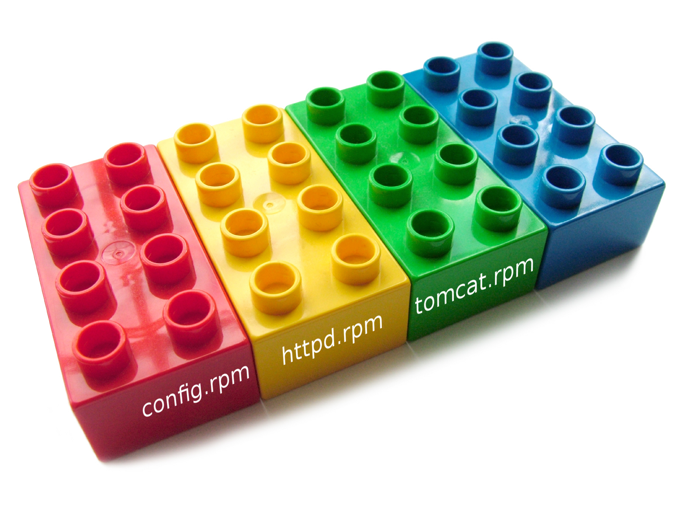

# Yadt | Modular Config

http://www.yadt-project.org/
 
 
2013-08-08&nbsp;&nbsp;|&nbsp;&nbsp;IT-Pro-SD&nbsp;&nbsp;|&nbsp;&nbsp;ImmobilienScout24

.fx: titleslide imageslide

---

# Present: Artefacts and Config

.fx: imageslide whiteheading

---

# Future: Modular Config

.fx: imageslide

---

## Artefacts with Config Snippets,

httpd.rpm: /etc/yadt.conf.d/20_httpd.yaml

    !python
    service:
        httpd:

+

tomcat.rpm: /etc/yadt.conf.d/30_tomcat.yaml

    !python
    service:
        tomcat:

---

## Merged in Filesystem,

    !python
    /etc/yadt.conf.d/
        00_defaults.yaml
        01_host_settings.yaml
        20_httpd.yaml
        30_tomcat.yaml

---

## ... Resulting in a MVYC

    !python
    services:
      - httpd:
      - tomcat:

<em>MVYC: Minimal Viable Yadt Configuration</em>

---

## How the Merge Happens:

* Arrays: extended
* Hashes: merged (yes, recursion)
* Scalars: overwritten (order matters!)

---

## Config Augmentation ...

httpd-with-tomcat.rpm: /etc/yadt.conf.d/40_httpd_with_tomcat.yaml

    !python
    service:
        httpd:
            needs_services: [tomcat]

---

## ... Gets Merged, too!

    !python
    /etc/yadt.conf.d/
        ...
        40_httpd_with_tomcat.yaml

&nbsp;

    !python
    services:
        httpd:
            needs_services: [tomcat]
        tomcat:

---

## Bonus: Even More Features

    !python
    settings: {
        'ARTEFACTS_INDUCING_REBOOT': ['kernel']
    }

---

# Making the jump!

.fx: imageslide whitetext

---

# But How?

&#x2190; we are here

## 1. standard rpms with standard config
## 2. custom config snippets  only when needed
## 3. your hosts without /etc/yadt.services

---

# But How?

0. &#x2190; we are here

## 1. standard rpms with standard config
## 2. custom config snippets  only when needed
## 3. your hosts without /etc/yadt.services

---

# Thanks!

http://www.yadt-project.org/
 
 
2013-08-08&nbsp;&nbsp;|&nbsp;&nbsp;IT-Pro-SD&nbsp;&nbsp;|&nbsp;&nbsp;ImmobilienScout24

.fx: titleslide imageslide

